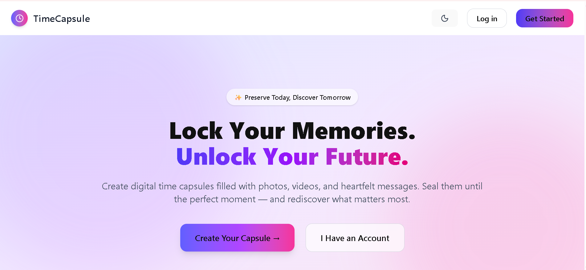

# 🚀 Digital Time Capsule – Frontend

## 📌 Project Description

Digital Time Capsule is a full-stack web application that allows users to store memories, messages, photos, and videos that remain locked until a future date.

Users can create multiple capsules, track their unlock progress, and revisit their past at the exact moment they planned.

This frontend is built using React and communicates with a Node.js backend and Supabase database.

## 🎯 Core Features

### 🔐 Authentication

* User registration and login
* Secure session handling using JWT
* Protected routes for authenticated users

### 📦 Time Capsule Management

* Create time capsules with:

  * Text messages
  * Images
  * Videos
* Set unlock date using date picker
* Multiple capsule support per user

### 🔒 Lock Mechanism

* Capsules become non-editable after creation
* Content remains hidden until unlock date

### 📊 Dashboard

* View all created capsules
* Unlock countdown / progress tracking
* Capsule summary (type of content, unlock date)

### 🔔 Notifications (Backend Triggered)

* Reminder alerts when unlocks through email 
* Unlock notification when capsule opens

## 🌟 Unique Features Implemented

* 🎁 Secret Messages (hidden until unlock)
* 👥 Future Recipients (email-based sharing)
* 🎨 Capsule Themes (UI personalization)
* ⏳ Unlock Progress Tracker (visual countdown)

## ⚙️ Tech Stack

* React.js
* Tailwind CSS
* ShadCN UI
* Axios
* Context API (State Management)
* React Router DOM

## 📂 Folder Structure

src/
│
├── components/      # Reusable UI components
├── pages/           # Application pages
├── context/         # Global state management
├── services/        # API calls (Axios)
├── utils/           # Helper functions
└── App.jsx

## 🔗 API Integration

All API calls are handled inside the `services/` folder using Axios.

### Example:

import axios from "axios";

const API = axios.create({
  baseURL: "https://digital-time-capsule-backend-ymlv.onrender.com/",
});

export const createCapsule = (data) => API.post("/capsules", data);

## 🧠 State Management

Context API is used for:

* Authentication state
* User session
* Capsule data caching (optional)

## 🎨 UI/UX Practices

* Reusable component design
* Clean layout using Tailwind
* Responsive design for mobile & desktop
* Minimal and intuitive user flow

## 🌐 Deployment

* **Frontend:** Netlify
* **Backend API:** Render

## 🔑 Demo Credentials

Email: testuser@gmail.com  
Password: test@123

## 📸 Screenshots

## 🎥 Video Walkthrough

## ⚙️ Installation

git clone https://github.com/KASIREDDYASMITHA/Ditital_Time_Capsule_Frontend
cd frontend-repo
npm install
npm run dev

## ⚠️ Known Limitations

* No offline support
* Limited theme customization
* File upload preview may lag for large videos

## 🚀 Future Improvements

* AI-assisted message writing
* Shareable capsule links with expiry
* In-app notification system
* Advanced analytics dashboard

## 👨‍💻 Author

KASIREDDY ASMITHA
Developed as part of a Full Stack Project.

